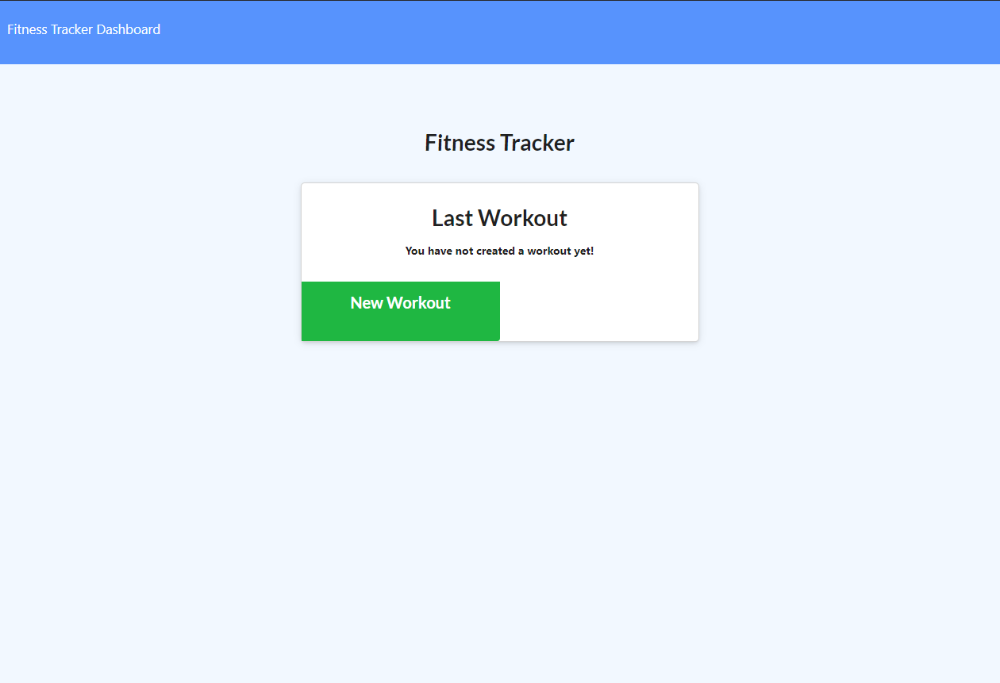

# Track-Fitness

## Description

This application lets users track their daily workouts. A Mongo database is used along with a Mongoose schema. It handles routes with Express and is  deployed with Heroku. Users exercises into a workout.

## Screenshot

## Link to Deployed Site

https://glacial-headland-04432.herokuapp.com/

## Table Of Contents

* [Installation](#installation)

* [Usage](#usage)

* [License](#license)

* [Contributing](#contributing)

* [Tests](#tests)

* [Questions](#questions)

# Installation

The following necessary dependencies must be installed to run the application properly: none

## Usage

This application is used for none

## License

This project is license under the MIT license.

[License](https://opensource.org/licenses/MIT)

Copyright 2021 William Miller

    Permission is hereby granted, free of charge, to any person obtaining a copy of this software and associated documentation files (the "Software"), to deal in the Software without restriction, including without limitation the rights to use, copy, modify, merge, publish, distribute, sublicense, and/or sell copies of the Software, and to permit persons to whom the Software is furnished to do so, subject to the following conditions:
    
    The above copyright notice and this permission notice shall be included in all copies or substantial portions of the Software.
    
    THE SOFTWARE IS PROVIDED "AS IS", WITHOUT WARRANTY OF ANY KIND, EXPRESS OR IMPLIED, INCLUDING BUT NOT LIMITED TO THE WARRANTIES OF MERCHANTABILITY, FITNESS FOR A PARTICULAR PURPOSE AND NONINFRINGEMENT. IN NO EVENT SHALL THE AUTHORS OR COPYRIGHT HOLDERS BE LIABLE FOR ANY CLAIM, DAMAGES OR OTHER LIABILITY, WHETHER IN AN ACTION OF CONTRACT, TORT OR OTHERWISE, ARISING FROM, OUT OF OR IN CONNECTION WITH THE SOFTWARE OR THE USE OR OTHER DEALINGS IN THE SOFTWARE.
    
    

## Contributing

Contributors: none

## Tests

To run tests, you need to run the following command: none

## Questions

If you have any questions about the repo, please reach out to my email at williamhmiller12@gmail.com.

